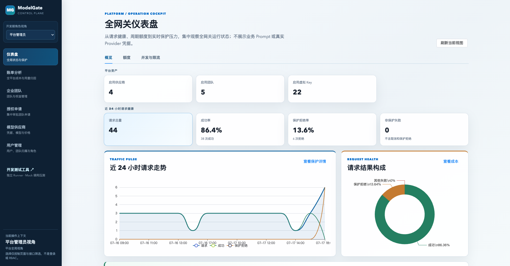
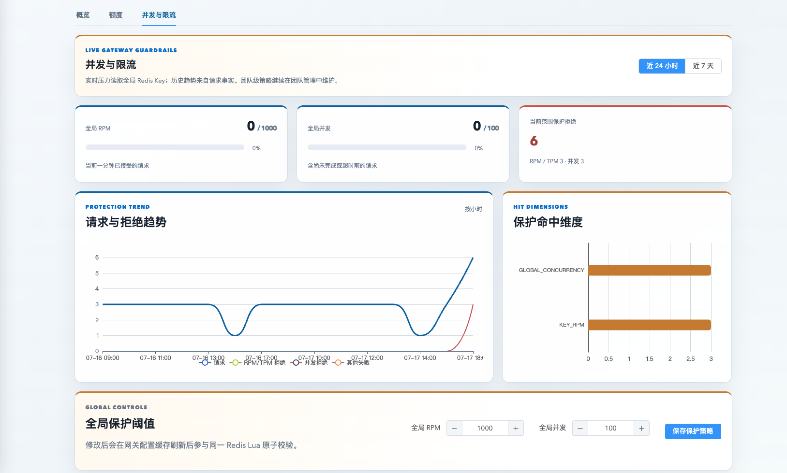
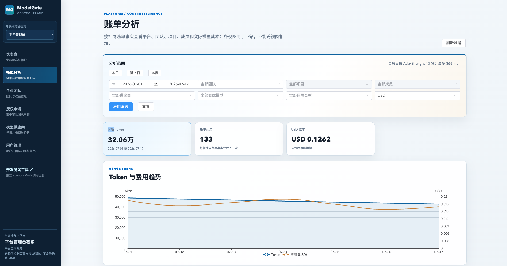
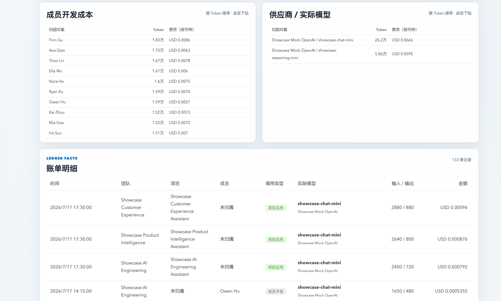
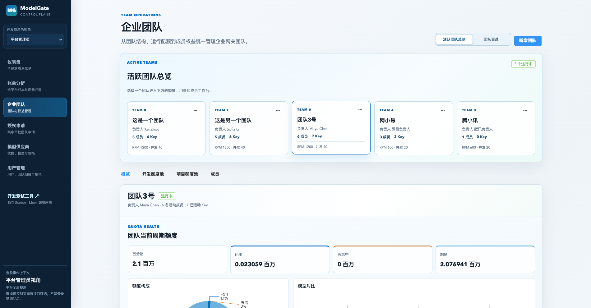
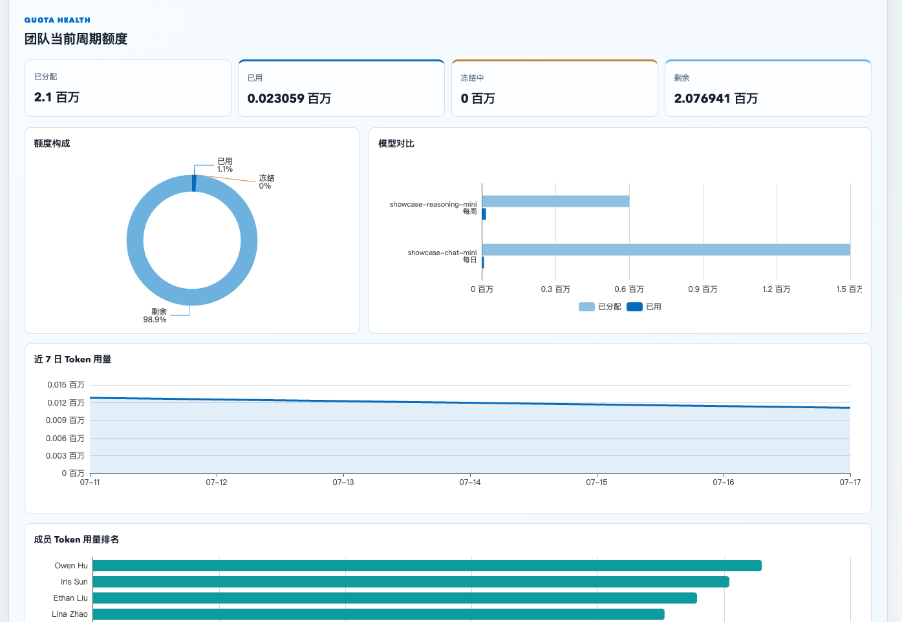
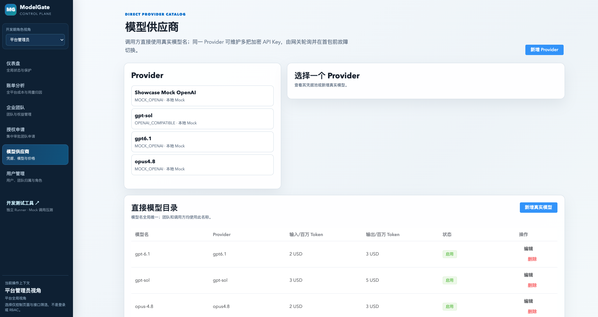
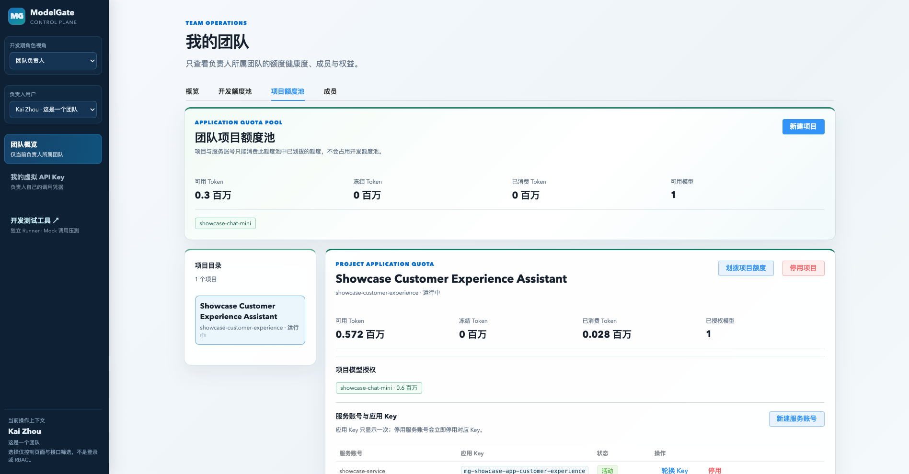
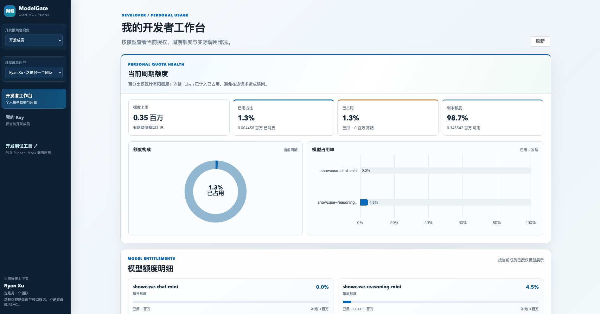

# ModelGate

ModelGate 是面向企业内部 Agent、AI 应用和研发工具的模型调用网关与用量计费平台。它位于业务系统与模型供应商之间，对调用方提供兼容 OpenAI 的统一接口；对平台侧集中处理鉴权、限流、并发控制、Token 额度、流式转发、用量统计和费用归因。

在多团队、多应用直接接入模型供应商的场景中，真实密钥容易分散在不同项目中，成本难以归因，调用配额与故障处理也缺少统一边界。ModelGate 通过虚拟 Key 隔离 Provider 凭据，通过 Redis 在请求主链路完成实时保护，并将用量、账单和审计写入可追溯的异步账本，从而将模型调用治理收敛为一套基础设施能力。

## 项目演示

网关中包含平台管理员、团队负责人和开发成员三大角色。暂未接入真实登陆鉴权，主要目的在于开发阶段演示不同层级的职责边界。

### 平台管理员

平台管理员负责全局运行状态、资源边界和成本归因。

#### 全网关运行总览

管理员可以查看已启用的供应商、团队和虚拟 Key，以及近 24 小时的请求量、成功率、保护拒绝与非保护失败。趋势图和请求结果构成帮助区分“网关主动保护”与“上游故障”的第一层运营视图。



#### 实时保护压力与全局阈值

限流页直接呈现 Redis 中的全局 RPM、并发占用、保护拒绝趋势和命中维度。管理员可以维护全局保护阈值；团队级策略仍在团队管理中维护，从而保留平台与团队两级控制边界。



#### 成本趋势与多维筛选

账单分析可以按时间、团队、项目、成员、供应商、实际模型和调用类型筛选，分别查看 Token 与费用趋势。金额按币种展示，不在界面中做未经配置的汇率换算。



#### 账单归因与明细下钻

管理员可从成员开发成本、Provider / 实际模型成本下钻到每条账单事实。成员开发与项目应用走并行归因链，避免将不同视图的汇总金额再次相加。



#### 团队目录与运行状态

企业团队页集中查看团队负责人、成员数、活跃 Key、RPM 与并发策略，并以团队为入口进入额度、成员和授权管理。这样可以先识别运行中的资源边界，再处理具体的团队配置。



#### 团队额度健康度

管理员可以按当前周期观察团队已分配、已用、冻结和剩余额度，并按模型比较额度分布与用量趋势。这使额度配置和运行时的冻结状态能够在同一工作台中核对。



#### Provider 与直接模型目录

模型供应商页面维护 Provider、直接模型名与输入/输出单价。调用方始终使用全局唯一的真实模型名；Provider 的多把凭据由服务端加密保存并在网关侧选择，界面不会回显明文。



### 团队负责人

团队负责人只处理自己所属团队的资源：查看团队额度与成员权益，创建项目，将团队项目额度划拨给项目，并管理项目服务账号和应用 Key。

#### 项目额度池与应用凭据

负责人可以将团队项目额度池中的模型额度分配给具体项目，查看可用、冻结与已消费 Token，并在项目内创建服务账号和轮换应用 Key。开发者个人额度与项目应用额度相互独立，避免研发工具和生产应用抢占同一个预算池。



### 开发成员

开发成员面向个人使用：查看自己已授权模型的当前周期额度、已用比例与剩余额度，并在个人 Key 页面生成或轮换仅属于自己的虚拟 Key。

#### 个人开发者工作台

个人工作台将额度总览、模型占用和逐模型额度明细放在一起。开发者能在调用前判断模型是否可用、当前周期还剩多少资源；网关在实际请求时仍会以 Redis 原子校验作为最终准入依据。



## 背景与目标

当多个 Agent、内部工具和业务服务直接调用模型供应商时，真实密钥会散落在各个项目中，限流与成本边界难以统一，出现故障也缺少一致的处理方式。ModelGate 将这些共性问题收敛为一个独立的基础设施层：

- 调用方只持有可独立吊销的虚拟 API Key，不接触真实 Provider 凭据。
- 以 OpenAI 风格 `POST /v1/chat/completions` 统一普通响应与 SSE 流式响应。
- 在 Redis 内原子执行多维限流、并发控制与两级模型额度预占，避免并发下部分扣减或超额消费。
- 将请求事实、用量、账单和额度流水落到 MySQL，使费用归因能够追溯与对账。
- 通过 Outbox 与 RocketMQ 解耦计量和账单消费者，并以幂等约束应对重复投递。
- 以本地 Mock Provider 覆盖正常、慢响应、超时、429、500、流中断等场景，不依赖真实模型费用即可演练主链路。

## 核心能力

| 领域 | 已实现能力 | 设计重点 |
| --- | --- | --- |
| 统一网关 | OpenAI 风格 Chat Completions；普通 JSON 与 SSE 流式转发 | WebFlux 非阻塞链路，流式内容逐片返回 |
| 凭据安全 | 虚拟 Key 哈希存储、仅首次展示明文；Provider 凭据 AES-GCM 加密 | 调用方与真实 Provider 密钥隔离 |
| 授权与缓存 | 团队/成员两层模型权益；Caffeine → Redis → MySQL 三级读取 | 控制面变更后通过 Redis Pub/Sub 失效本地缓存 |
| 流量保护 | Key、团队、全局 RPM / TPM / 并发控制 | 单次 Redis Lua 原子检查，不产生部分扣减 |
| 额度管理 | 团队与成员（或项目）逐模型、逐周期额度预占、结算、释放 | 请求失败、超时或取消后正确清理冻结与并发状态 |
| Provider 接入 | Mock Provider、OpenAI-Compatible Provider、凭据池轮询 | 首包前可切换一次备用凭据；错误不泄露私有配置 |
| 异步计量 | Usage Outbox、RocketMQ 投递、用量/账单/审计消费者 | 消费记录与业务唯一键确保重复消费不重复计费 |
| 管理控制台 | 团队、成员、模型、Key、额度、用量、账单与保护概览 | 面向运维和排障的密集型工作台，而非营销页面 |

## 一次请求如何流转

```text
Client / Agent
      │  Bearer 虚拟 Key + OpenAI-style request
      ▼
ModelGate 数据面（Spring WebFlux）
      │  1. Caffeine → Redis → MySQL 鉴权上下文
      │  2. 校验团队与成员的模型权益
      │  3. Redis Lua：限流 / 并发 / Token 额度原子预占
      │  4. 选择 Provider 凭据并转发普通响应或 SSE
      ▼
Model Provider / Mock Provider
      │  usage、延迟、状态
      ▼
Usage Outbox → RocketMQ → 用量 / 账单 / 预算 / 审计消费者 → MySQL 事实账本
```

这里最重要的边界是：Redis 负责“此刻能否放行”的实时决策，MySQL 负责最终事实与账本；RocketMQ 传播领域事件，不承担普通日志职责。这样可以避免把每次模型请求都压到数据库，也能在异步重试与重复消费时保持最终一致。

## 关键工程取舍

### 额度不能只扣余额

模型请求开始前并不知道实际输出 Token。网关先按输入和 `max_tokens` 估算并冻结额度，完成后按实际用量结算，失败时释放冻结；团队和成员（或应用）两个层级同步执行。核心状态转换由 Redis Lua 原子完成，因此并发请求不会只扣到某个维度就失败。

### SSE 是完整的资源生命周期

流式请求不能等上游完整响应再返回。网关会持续转发上游片段，并处理首事件超时、流中空闲超时、上游中断与客户端取消。无论哪种结束路径，都要恰好一次地释放并发、结算或释放冻结额度，并生成对应的用量事件。

### 异步并不等于可以重复记账

请求主链路写入确定性事件 ID 的 Outbox；消费者在同一数据库事务中记录消费状态并执行业务处理，账单和额度流水另有业务唯一约束兜底。这个设计针对的是“数据库提交成功但 ACK 失败”这类常见重复投递场景，而不是不切实际地宣称端到端 exactly-once。

## 技术栈

- 后端：Java 17、Spring Boot 3、Spring WebFlux、Reactor、Flyway、Maven 多模块
- 数据与中间件：MySQL、Redis、Redis Lua、RocketMQ
- 安全与可靠性：AES-GCM、Caffeine、Outbox、消费幂等、Provider 超时与首包前凭据切换
- 前端：Vue 3、TypeScript、Vite、Element Plus、ECharts

## 项目结构

```text
model-gate
├── modelgate-bootstrap       # 应用入口、HTTP API、Provider 转发
├── modelgate-auth            # 虚拟 Key、权限与缓存失效
├── modelgate-quota           # Token 估算、额度预占与结算
├── modelgate-provider        # Provider 抽象、Mock Provider
├── modelgate-usage           # Outbox、用量、预算与审计
├── modelgate-billing         # RocketMQ 消费与账单
├── modelgate-infrastructure  # MySQL / Redis 等基础设施实现
├── modelgate-common          # API、领域对象与事件契约
├── frontend                  # Vue 管理控制台
└── tools/modelgate-test-runner # 多开发者 Mock 调用测试工具
```

第一版保持为 Maven 模块化单体：部署和本地调试更简单，代码边界则为未来将延迟敏感的数据面与吞吐优先的异步计量拆分预留空间。

## 快速开始

### 前置条件

- JDK 17+
- Maven 3.9+
- MySQL 8+
- Redis 6+
- Node.js 20+（仅运行管理控制台时需要）

本地默认连接 `localhost` 上的 MySQL 数据库 `modelgate`（用户名、密码均为 `modelgate`）和 Redis。请先创建本地数据库，并按需通过环境变量覆盖连接信息。开发期默认关闭 RocketMQ；开启后才会将 Usage Event 投递给实际消费者。

```bash
export MODELGATE_MYSQL_URL='jdbc:mysql://localhost:3306/modelgate?useSSL=false&serverTimezone=Asia/Shanghai&allowPublicKeyRetrieval=true'
export MODELGATE_MYSQL_USERNAME='modelgate'
export MODELGATE_MYSQL_PASSWORD='modelgate'
export MODELGATE_REDIS_HOST='localhost'
export MODELGATE_REDIS_PORT='6379'
export MODELGATE_ROCKETMQ_ENABLED='false'
```

启动后端：

```bash
mvn -pl modelgate-bootstrap -am install
mvn -pl modelgate-bootstrap spring-boot:run
```

另开一个终端启动管理控制台：

```bash
cd frontend
npm install
npm run dev
```

控制台默认地址为 `http://localhost:5173`，Vite 会将 `/admin` 与 `/v1` 代理到 `http://localhost:8080`。初始化一组可重复执行的演示数据：

```bash
curl -X POST http://localhost:8080/admin/bootstrap/showcase
```

> `showcase` 只写入本地 Mock 数据，不生成可用明文 Key、不调用真实 Provider，也不会投递 RocketMQ。更多环境配置、SSE 调用和故障演练方式请见[运行手册](docs/MVP_RUNBOOK.md)。

## 验证重点

项目以 Mock Provider 作为可控测试替身，重点覆盖以下风险最高的路径：

- 普通响应与 SSE 逐片转发，而不是缓冲完整响应。
- 限流、并发与两层额度在并发下原子生效；失败请求释放冻结额度。
- 首事件超时、流中断和客户端取消后，不泄漏并发计数，也不重复结算。
- Usage Event 重复投递时，用量、账单和额度流水保持幂等。
- Key 禁用或权限收回后，Redis 与本地鉴权缓存及时失效。

运行后端测试：

```bash
mvn -pl modelgate-bootstrap -am test
```

构建前端：

```bash
cd frontend
npm run build
```

完整的测试与压测场景见[测试与压测方案](docs/TESTING.md)。目前不在 README 中虚构吞吐或 P99 数字；这类指标应来自可复现的压测环境与报告。

## 当前边界与后续方向

当前版本以核心调用闭环和可靠性设计为重点，已具备 Mock 与 OpenAI-Compatible 接入、团队/成员/项目额度、流式调用和管理台；真实登录与 RBAC、跨模型智能路由、熔断降级、全链路监控和 Provider 账单回查仍属于后续演进方向。详细计划见[开发路线图](docs/ROADMAP.md)。

## 文档导航

- [产品需求](docs/PRD.md)：用户、范围与验收场景
- [架构设计](docs/ARCHITECTURE.md)：控制面、数据面与异步计量边界
- [API 契约](docs/API_CONTRACT.md)：OpenAI 风格接口、管理接口与错误语义
- [数据模型](docs/DATA_MODEL.md)：权限、Key、额度、用量与账单事实
- [可靠性设计](docs/RELIABILITY.md)：缓存失效、Lua 原子性、SSE 生命周期与幂等
- [MVP 运行手册](docs/MVP_RUNBOOK.md)：本地启动、演示数据和故障演练
- [测试与压测方案](docs/TESTING.md)：并发、流式、积压恢复与验收标准

## 安全说明

- 仓库不应提交真实 Provider API Key、私有端点、Workspace / 租户标识或签名 URL。
- 虚拟 API Key 仅保存前缀和哈希；明文只在生成或轮换时返回一次。
- Provider 凭据以 AES-GCM 密文保存，API 与日志均不返回明文。
- 管理台中的角色切换当前仅用于开发期展示和默认筛选，不构成生产 RBAC。
