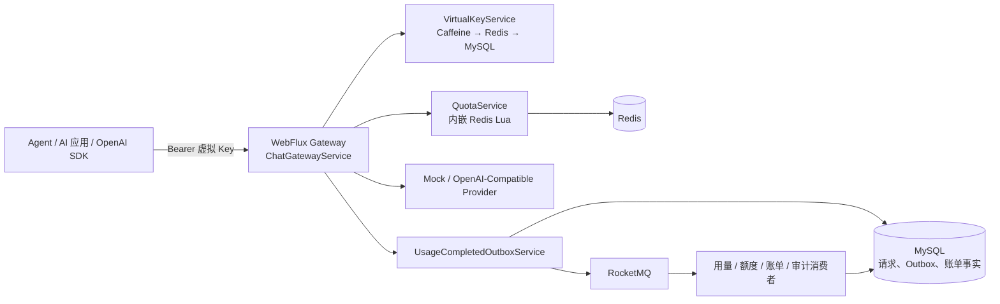

# ModelGate

ModelGate 是面向 Agent、AI 应用和研发工具的模型调用网关与用量计费平台，对外提供兼容 OpenAI 的 Chat Completions 接口。

当多个应用直接调用模型供应商时，真实 API Key 往往分散在不同代码库中；调用成本难以按团队、成员或项目归因；限流、并发和 Token 额度也无法在一个入口统一控制。

ModelGate 使用虚拟 API Key 隔离 Provider 凭据，在 Redis 中完成限流、并发和额度预占，通过 WebFlux 转发普通响应与 SSE 流式响应，并以 Outbox、RocketMQ 和 MySQL 记录用量、账单与审计事实。


> 管理控制台主页展示供应商、团队、虚拟 Key、请求量、保护拒绝和请求结果趋势；截图数据来自本地 Showcase Mock 数据。

## 核心能力

| 能力 | 已实现行为 | 关键组件 |
| --- | --- | --- |
| 统一调用入口 | 提供 `POST /v1/chat/completions`，支持普通 JSON 与 SSE | Spring WebFlux、Provider Adapter |
| 虚拟 API Key | 只保存 Key 前缀和 SHA-256 哈希；校验 Key 状态与模型权限 | Caffeine、Redis、MySQL |
| 请求保护 | 在一次 Redis Lua 调用中校验 RPM、TPM、并发和额度 | Redis ZSET / Hash、Lua |
| 模型额度 | 按团队与成员（或项目）逐模型、逐周期预占、结算与释放 Token | Redis、MySQL 权益记录 |
| Provider 接入 | 支持 Mock 与 OpenAI-Compatible Provider；凭据池轮询和首包前切换 | AES-GCM、WebClient |
| 异步计量 | 请求完成后写入 Usage Outbox，由消费者落用量、账单、预算告警和审计 | RocketMQ、MySQL 唯一约束 |
| 管理控制台 | 提供团队、成员、模型、Key、额度、账单和网关保护页面 | Vue 3、Element Plus、ECharts |

> 管理控制台当前未接入用户登录与 RBAC，页面中的角色切换仅用于开发和演示。模型调用接口已实现虚拟 API Key 鉴权、Key 状态校验和模型权限控制。

## 系统架构



调用进入网关后，先解析虚拟 Key 并校验模型权限，再执行 Redis 限流、并发和额度预占。Provider 返回普通响应或流式片段后，网关结算或释放额度，并在同一请求终态事务中写入 Outbox；后续消费者异步生成用量、账单和审计记录。

## 项目演示

### 平台管理员

管理员可查看全网请求量、成功率、保护拒绝和 Provider 调用失败。仪表盘分别统计网关限流、额度拒绝和上游调用失败，便于判断请求失败发生在网关侧还是 Provider 侧。


管理员可以查看 Redis 中的全局 RPM、并发占用、保护拒绝趋势和命中维度，并修改全局 RPM 与并发阈值。团队级限流配置在团队详情中单独维护。


账单分析支持按时间、团队、项目、成员、供应商、实际模型和调用类型筛选，并分别展示 Token 与费用趋势。金额按币种返回，不在查询层做汇率换算。


账单页可从成员开发成本或 Provider / 实际模型成本下钻到单条账单记录，记录中保留团队、项目、成员、调用类型、输入/输出 Token 和金额。


管理员可从团队列表查看负责人、成员数量、活跃 Key 数量、RPM 与并发配置，并进入团队详情继续管理成员与模型权限。


团队详情按当前周期展示已分配、已用、冻结和剩余额度，并提供按模型的额度对比、近 7 天 Token 用量和成员用量排行。


模型供应商页管理 Provider、直接模型名和输入/输出单价。Provider 凭据由服务端加密保存，控制台不回显明文；调用方只传全局唯一的模型名。


### 团队负责人

团队负责人管理所属团队的项目额度池：创建项目，将团队项目额度分配给项目，查看可用、冻结与已消费 Token，并在项目内管理服务账号与应用 Key。开发者个人额度和项目应用额度使用独立额度池。


### 开发成员

开发成员在个人工作台查看已授权模型、当前周期额度、已用比例和剩余额度；个人 Key 页面支持生成或轮换仅绑定该成员的虚拟 Key。网关在请求进入 Provider 前仍会重新校验额度状态。


## 快速开始

### 前置条件

- JDK 17+
- Maven 3.9+
- MySQL 8+
- Redis 6+
- Node.js 20+（运行管理控制台时需要）

本地默认连接 `localhost` 上的 MySQL 数据库 `modelgate`（用户名、密码均为 `modelgate`）和 Redis。请先创建本地数据库，并按需通过环境变量覆盖连接信息。开发期默认关闭 RocketMQ；启用后才会向实际消费者投递 Usage Event。

```bash
export MODELGATE_MYSQL_URL='jdbc:mysql://localhost:3306/modelgate?useSSL=false&serverTimezone=Asia/Shanghai&allowPublicKeyRetrieval=true'
export MODELGATE_MYSQL_USERNAME='modelgate'
export MODELGATE_MYSQL_PASSWORD='modelgate'
export MODELGATE_REDIS_HOST='localhost'
export MODELGATE_REDIS_PORT='6379'
export MODELGATE_ROCKETMQ_ENABLED='false'
```

启动后端：

```bash
mvn -pl modelgate-bootstrap -am install
mvn -pl modelgate-bootstrap spring-boot:run
```

另开一个终端启动管理控制台：

```bash
cd frontend
npm install
npm run dev
```

控制台默认地址为 `http://localhost:5173`，Vite 会将 `/admin` 与 `/v1` 代理到 `http://localhost:8080`。初始化可重复执行的 Showcase 数据：

```bash
curl -X POST http://localhost:8080/admin/bootstrap/showcase
```

> `showcase` 只写入本地 Mock 数据，不生成可用明文 Key、不调用真实 Provider，也不会投递 RocketMQ。更多环境配置、SSE 调用和故障演练方式请见[运行手册](docs/MVP_RUNBOOK.md)。

## 技术设计与代码证据

### 虚拟 API Key 鉴权与三级缓存

网关从 `Authorization: Bearer <key>` 读取虚拟 Key，计算 SHA-256 哈希后按 Caffeine、Redis、MySQL 顺序查询 `ApiKeyContext`。读取到上下文后会检查 Key 是否启用、是否过期，以及当前请求模型是否在授权集合内；管理端禁用 Key 或调整权限时会清理缓存并发布失效事件。

相关实现：

- [VirtualKeyService](modelgate-auth/src/main/java/com/modelgate/auth/VirtualKeyService.java)：Key 哈希、认证、模型权限检查、Caffeine 和 Redis 缓存。

### Redis Lua 原子保护

请求进入 Provider 前，[QuotaService](modelgate-quota/src/main/java/com/modelgate/quota/QuotaService.java) 的内嵌 `RESERVE_SCRIPT` 在一次 Lua 调用中检查 Key / 团队 RPM、团队 TPM、全局 RPM、Key / 团队 / 模型 / 全局并发，以及团队和成员两层模型额度。所有检查通过后才写入限流、并发和冻结状态；任一维度不满足时不会修改其他状态。

同一类脚本还负责结算与释放：成功请求按实际 Token 结算，未产生输出的失败或取消请求释放预占额度，并移除并发记录。

相关实现：

- [QuotaService](modelgate-quota/src/main/java/com/modelgate/quota/QuotaService.java)：`RESERVE_SCRIPT`、`SETTLE_SCRIPT`、`RELEASE_SCRIPT` 与 `reserve` / `settle` / `release` 方法。

### 普通响应与 SSE 生命周期

[ChatGatewayService](modelgate-bootstrap/src/main/java/com/modelgate/bootstrap/api/ChatGatewayService.java) 分别处理普通响应和 SSE。流式路径通过 `Flux` 逐片转发内容，记录首 Token 时间与已生成内容；流完成、超时、上游中断或客户端取消时，只执行一次结算或释放，并写入终态事件。OpenAI-Compatible Provider 的 SSE 解析和凭据轮换在 [OpenAiCompatibleProviderClient](modelgate-bootstrap/src/main/java/com/modelgate/bootstrap/api/OpenAiCompatibleProviderClient.java) 中实现，首事件和流中空闲超时由 [ProviderTimeouts](modelgate-bootstrap/src/main/java/com/modelgate/bootstrap/api/ProviderTimeouts.java) 处理。

相关实现：

- [ChatGatewayService](modelgate-bootstrap/src/main/java/com/modelgate/bootstrap/api/ChatGatewayService.java)：普通调用、SSE 转发、取消与失败清理。
- [OpenAiCompatibleProviderClient](modelgate-bootstrap/src/main/java/com/modelgate/bootstrap/api/OpenAiCompatibleProviderClient.java)：OpenAI-Compatible 普通与流式请求。
- [ProviderTimeouts](modelgate-bootstrap/src/main/java/com/modelgate/bootstrap/api/ProviderTimeouts.java)：首事件和空闲超时。

### Outbox 与账单消费幂等

[UsageCompletedOutboxService](modelgate-usage/src/main/java/com/modelgate/usage/UsageCompletedOutboxService.java) 在同一事务中更新请求终态并插入带确定性事件 ID 的 `usage_event_outbox` 记录。[RocketMqOutboxDispatcher](modelgate-usage/src/main/java/com/modelgate/usage/RocketMqOutboxDispatcher.java) 只发送已提交的 Outbox 行，发送失败后重新安排投递。账单消费者先向 `mq_consume_record` 写入 `(eventId, consumerGroup)`；重复消息因唯一键冲突直接返回，避免重复生成账单。

相关实现：

- [UsageCompletedOutboxService](modelgate-usage/src/main/java/com/modelgate/usage/UsageCompletedOutboxService.java)：请求终态与 Outbox 同事务写入。
- [RocketMqOutboxDispatcher](modelgate-usage/src/main/java/com/modelgate/usage/RocketMqOutboxDispatcher.java)：Outbox 轮询、租约和失败重试。
- [BillingService](modelgate-billing/src/main/java/com/modelgate/billing/BillingService.java)：账单消费者入口。
- [UsageEventConsumerRepository](modelgate-infrastructure/src/main/java/com/modelgate/infrastructure/db/UsageEventConsumerRepository.java)：消费去重记录。

## 项目结构

```text
model-gate
├── modelgate-bootstrap         # 应用入口、HTTP API、Provider 转发
├── modelgate-auth              # 虚拟 Key、权限与缓存失效
├── modelgate-quota             # Token 估算、额度预占与结算
├── modelgate-provider          # Provider 抽象、Mock Provider
├── modelgate-usage             # Outbox、用量、预算与审计
├── modelgate-billing           # RocketMQ 消费与账单
├── modelgate-infrastructure    # MySQL / Redis 等基础设施实现
├── modelgate-common            # API、领域对象与事件契约
├── frontend                    # Vue 管理控制台
└── tools/modelgate-test-runner # 多开发者 Mock 调用测试工具
```

后端使用 Java 17、Spring Boot 3、Spring WebFlux、Flyway、MySQL、Redis 与 RocketMQ；前端使用 Vue 3、TypeScript、Vite、Element Plus 与 ECharts。

## 验证重点

Mock Provider 用于覆盖不依赖真实模型费用的主链路与故障场景：

- 普通响应与 SSE 均逐片转发，不等待完整上游响应。
- 并发请求下，限流、并发和两层额度只能全部成功或全部拒绝。
- 首事件超时、流中断和客户端取消后，并发记录与冻结额度只清理一次。
- 同一个 Usage Event 重复投递时，不重复写入用量、账单和额度流水。
- Key 禁用或模型权限收回后，Redis 和本地鉴权缓存失效。

运行后端测试：

```bash
mvn -pl modelgate-bootstrap -am test
```

构建前端：

```bash
cd frontend
npm run build
```

完整的测试与压测场景见[测试与压测方案](docs/TESTING.md)。README 不包含未经可复现压测验证的吞吐、P95 或 P99 数据。

## 当前边界与路线图

当前版本已实现 Mock 与 OpenAI-Compatible 接入、虚拟 API Key、团队 / 成员 / 项目额度、流式调用、异步计量和管理控制台。管理控制台尚未接入真实登录与 RBAC；跨模型智能路由、熔断降级、全链路监控和 Provider 账单回查属于后续工作。详细计划见[开发路线图](docs/ROADMAP.md)。

## 文档导航

- [产品需求](docs/PRD.md)：用户、范围与验收场景
- [架构设计](docs/ARCHITECTURE.md)：控制面、数据面与异步计量边界
- [API 契约](docs/API_CONTRACT.md)：OpenAI 风格接口、管理接口与错误语义
- [数据模型](docs/DATA_MODEL.md)：权限、Key、额度、用量与账单事实
- [可靠性设计](docs/RELIABILITY.md)：缓存失效、Lua 原子性、SSE 生命周期与幂等
- [MVP 运行手册](docs/MVP_RUNBOOK.md)：本地启动、演示数据和故障演练
- [测试与压测方案](docs/TESTING.md)：并发、流式、积压恢复与验收标准

## 安全说明

- 仓库不提交真实 Provider API Key、私有端点、Workspace / 租户标识或签名 URL。
- 虚拟 API Key 仅保存前缀和哈希；明文只在生成或轮换时返回一次。
- Provider 凭据以 AES-GCM 密文保存，API 与日志不返回明文。
- 管理控制台的角色切换仅用于开发和演示，不构成生产 RBAC。
